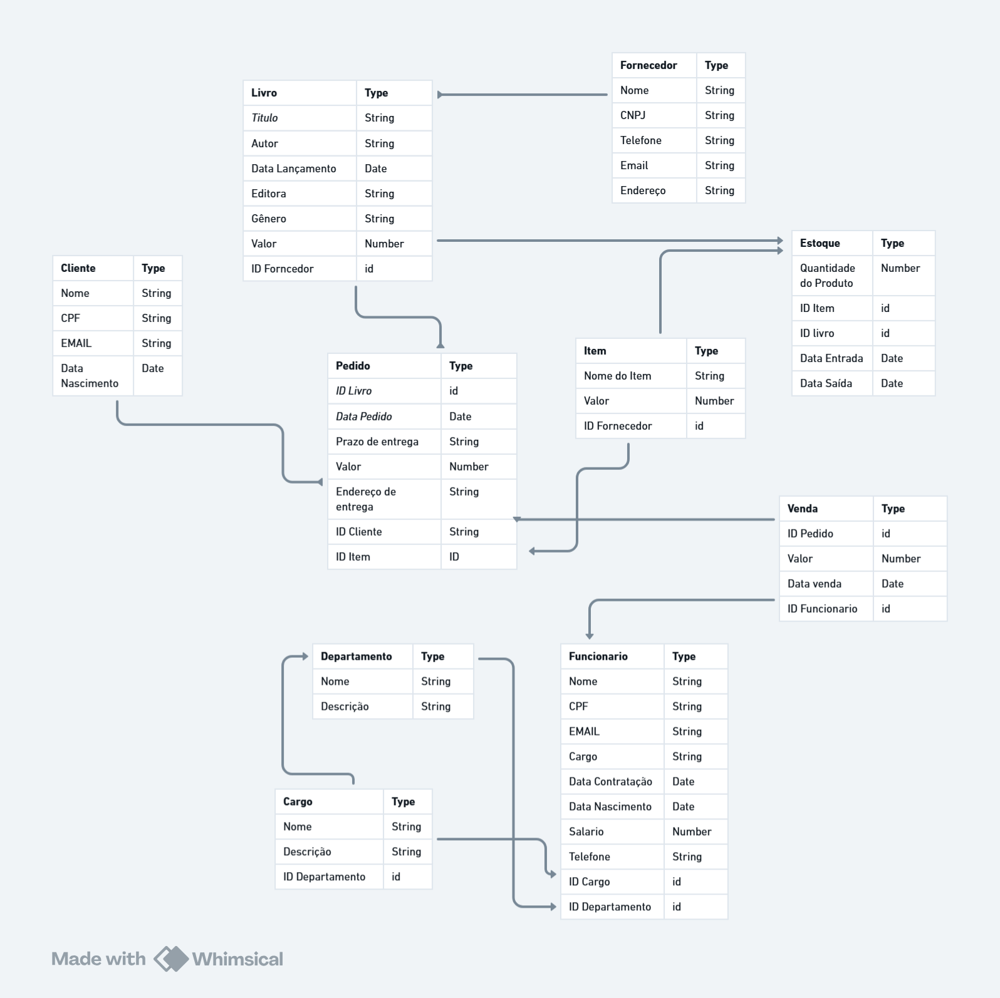

# Livraria API – Backend REST com Node.js, Express e MongoDB

# Integrantes
- Ana Clara Lima — responsável pelos CRUDs de Livro, Estoque e Fornecedor e README.md.
- Luíza Eduarda Batista — responsável pelos CRUDs de Funcionário, Departamento, Cargo, Pedido, e Issues do GitHub.
- Ana Carolina Rosendo — responsável pelo CRUDs de Cliente, Venda, Item e a Documentação Postman.

# GIT USERS
- Ana Clara - commit-ana
- Luíza Eduarda - Lu-2112
- Ana Carolina - carolinaarosendo

# Tecnologias Utilizadas
- Node.js
- Express
- MongoDB Atlas
- Mongoose
- Yup
- Dotenv
- Git & GitHub
- Postman

# Descrição do Sistema

A Livraria API é um sistema backend desenvolvido para gerenciar os principais processos de uma livraria.
O projeto implementa CRUDs completos, relacionamentos entre collections, validação de dados, persistência em MongoDB Atlas e documentação no Postman.

O sistema contempla operações essenciais como cadastro de livros, controle de estoque, registro de fornecedores, além de entidades complementares como clientes, pedidos, cargos, vendas, itens, departamento e funcionários.
O objetivo é aplicar práticas profissionais de desenvolvimento backend, seguindo padrões REST, organização modular e versionamento Git colaborativo.

# Funcionalidades Implementadas

- Cadastro, listagem, atualização e remoção de livros
- Cadastro de fornecedores e vínculo com livros
- Controle de estoque
- Cadastro de clientes com CPF
- Criação de pedidos relacionados a clientes
- Itens de pedido vinculados a produtos (livros)
- Cadastro de editoras
- Validações com Yup e Mongoose
- Estrutura modular de rotas, controllers, models e validators
- Documentação completa no Postman
- Conexão segura com o MongoDB Atlas via .env

# Lista de Endpoints com Exemplos

| Método | Rota          | Descrição       |
| ------ | ------------- | --------------- |
| POST   | `/livros`     | Cadastrar livro |
| GET    | `/livros`     | Listar todos    |
| GET    | `/livros/:id` | Buscar por ID   |
| PUT    | `/livros/:id` | Atualizar       |
| DELETE | `/livros/:id` | Remover         |

Exemplos:
{
  "titulo": "A Vida Invisível",
  "autor": "V. Schwab",
  "preco": 45.90,
  "categoria": "6754eab123456",
  "fornecedor": "678ac8910abcde",
  "editora": "675abd8721ff21"
}

# Fornecedores
| Método | Rota              |
| ------ | ----------------- |
| POST   | /fornecedores     |
| GET    | /fornecedores     |
| GET    | /fornecedores/:id |
| PUT    | /fornecedores/:id |
| DELETE | /fornecedores/:id |

- Outras entidades seguem a mesma estrutura CRUD:

/clientes
/pedidos
/itens
/estoque
/fornecedor
/funcionarios
/cargo
/departamentos
/vendas

#  Breve Descrição das Collections e Relacionamentos
A seguir está uma descrição das principais collections e como elas se relacionam entre si.

### Livro
Armazena informações sobre livros disponíveis para venda.
Cada livro possui:

- Dados bibliográficos (título, autor, editora, gênero etc.)

- Valor

- ID do Fornecedor → relacionamento com a collection Fornecedor

### Fornecedor
Contém informações dos fornecedores de livros e itens.
Relacionamentos:

- Um fornecedor pode fornecer vários livros.

- Um fornecedor pode fornecer vários itens.

### Item
Representa itens genéricos no estoque (além dos livros).
Atributos:

- Nome do item

- Valor

- ID do Fornecedor

Usado em pedidos e estoque.

E assim sucessivamente em todas as outras entidades.

### Relacionamentos
Fornecedor → Livro / Item (1:N)

Livro / Item → Estoque (1:N)

Cliente → Pedido (1:N)

Pedido → Venda (1:1)

Funcionario → Venda (1:N)

Departamento → Funcionario (1:N)

Cargo → Funcionario (1:N)

Departamento → Cargo (1:N)

# Diagrama de Modelagem

# Instalação, Configuração e Execução
- 1️º Clonar o repositório
git clone https://github.com/SEU_USUARIO/NOME_DO_REPOSITORIO.git
cd NOME_DO_REPOSITORIO

- 2️º Instalar dependências
npm install

- 3️º Configurar variáveis de ambiente
Criar arquivo .env:
DB_HOST=clusterdb1.sai4tem.mongodb.net
DB_USER=claralimadb
DB_PASS=SUA_SENHA
DB_NAME=livrariaDB
PORT=3000

4️º Executar o servidor
npm start

# Comunicação com o Banco de Dados

A comunicação com o MongoDB Atlas é feita usando:
const MONGO_URI = `mongodb+srv://${DB_USER}:${DB_PASS}@${DB_HOST}/${DB_NAME}?retryWrites=true&w=majority`;

- O Mongoose gerencia:
-conexão
-schemas
-validações
-interações CRUD

# Descrição Detalhada das Contribuições
### ANA CAROLINA

Responsável por entidades essenciais relacionadas à interação com o cliente e ao fluxo de vendas. Suas contribuições incluem:

- Cliente: Modelagem, criação da collection, rotas e documentação da entidade responsável pelos dados dos consumidores.

- Venda: Desenvolvimento completo da estrutura de vendas, incluindo relacionamentos com Pedido e Funcionário.

- Item: Implementação da entidade de itens adicionais do sistema, com suas operações CRUD e vínculos com Fornecedor e Pedido.

- Documentação Postman: Preparação da documentação de testes das rotas no Postman, garantindo clareza e padronização no uso da API.

### ANA CLARA

Contribuiu com entidades diretamente ligadas ao catálogo e suprimentos da empresa, além de documentação técnica global. Suas tarefas incluíram:

- Livro: Criação da collection, atributos, relacionamentos e rotas envolvendo fornecedores.

- Fornecedor: Desenvolvimento da entidade responsável pelo cadastro e gerenciamento de fornecedores.

- Estoque: Estruturação completa do controle de estoque, vinculando livros e itens às suas movimentações.

- README: Produção da documentação geral do projeto, organização das seções e padronização da apresentação final.

### LUIZA EDUARDA

Responsável pelas entidades administrativas internas do sistema e por tarefas centrais de fluxo e organização do projeto. Suas contribuições foram:

- Funcionário: Implementação da collection, rotas e relacionamentos envolvendo vendas, cargos e departamentos.

- Departamento: Criação da estrutura hierárquica administrativa, com atributos e vínculos aos cargos e funcionários.

- Cargo: Desenvolvimento da entidade de cargos, com definição de responsabilidades e relação com funcionários.

- Pedido: Construção da modelagem completa de pedidos, incluindo relacionamento com Clientes, Itens e Livros.

- Issues: Organização e acompanhamento das issues do projeto, distribuição de tarefas e controle de andamento no repositório.
